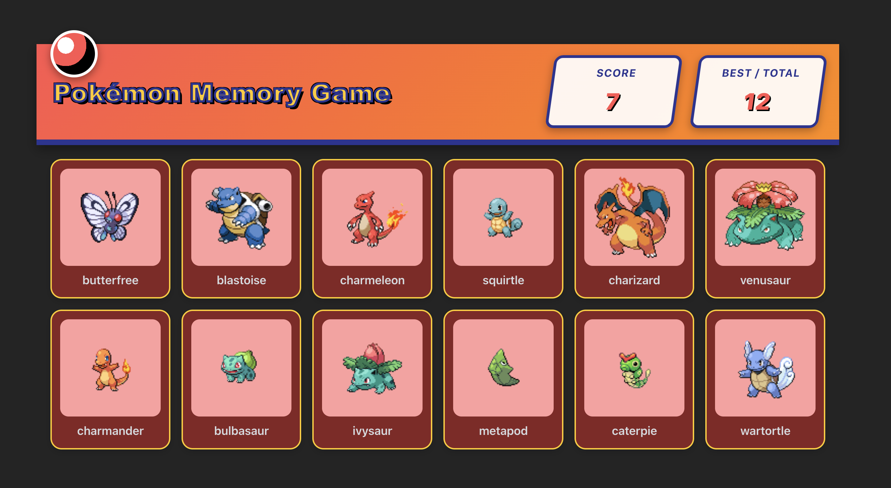

# Pokémon Memory Card Game

A memory training game built using **React.js**, HTML, and vanilla CSS.

## 🎮 How to Play

1. The game displays 12 unique Pokémon cards.
2. Click on a card to earn a point.
3. After every click, the deck **shuffles** its position.
4. **The Catch:** If you click the same Pokémon more than once, your score resets to zero.
5. Try to reach the maximum score of 12!
